# FriendSync, Architecture and API

---

## Introduction

The "FriendSync" mobile H5 website is a platform designed to help users find like-minded individuals to collaborate with based on shared interests and learning goals. The system will allow users to create and update profiles, search for other users by specific tags (such as learning topics, skills, or interests), build virtual rooms and teams, and receive recommendations for similar users.

### Functional Requirement

- User Authentication and Management
  
  1. Users can register, login, and log out using their credentials.
  
  2. Users can update their personal profiles, including interests and tags.

- User Search and Tagging
  
    1. Users can search for other users based on tags and interests.

- Room and Team Creation
  
  1. Users can create learning rooms or teams where they can collaborate on specific topics or projects.
  
  2. Each room can be dedicated to a specific topic or interest, and users can join based on their interests.

- Recommendations and Suggestions
  
  1. The system will recommend similar users based on tags, shared interests, and learning goals.

- Social Interaction Features
  
  1. Users can interact within teams, exchange messages, and collaborate in shared rooms.

### Non-functional Requirement

- Efficiency
  The server and client are required to respond within 2 seconds after a single user operation.

- Safety and Security

- Usability
  The client must be usable on major decent browsers, including Firefox and Chrome.

- Robustness
  The server should be fault tolerant and have error handling methods.

---

## System architecture

*FriendSync* takes client-server architecture, and uses an [MySQL]([MySQL](https://www.mysql.com/)) database for storing relational data.

Major components:

- Client
  Client is a web site based on [Vue](https://vuejs.org/).

- Server
  Server is developed by [Spring Boot](https://spring.io/) framework.

- Database MySQL database

- Third party login API

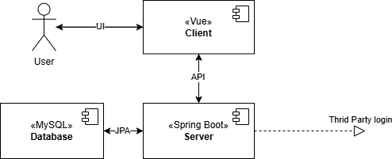

---

## Data Model

### Building Block View

In the FriendSync application, there are 3 main aspects:

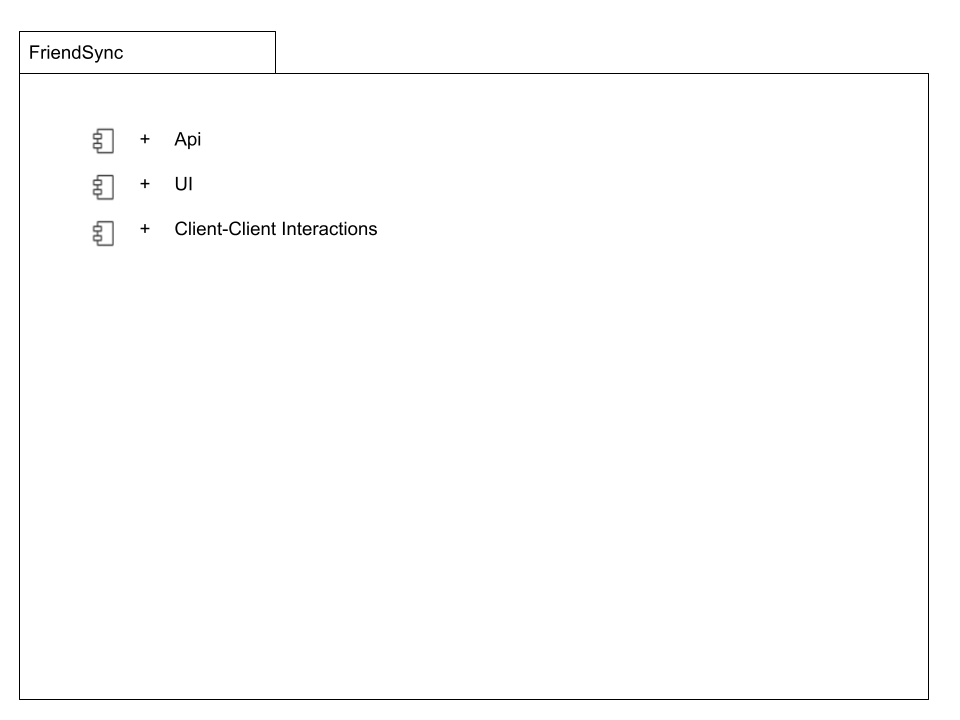

The main building blocks of the FriendSync system:

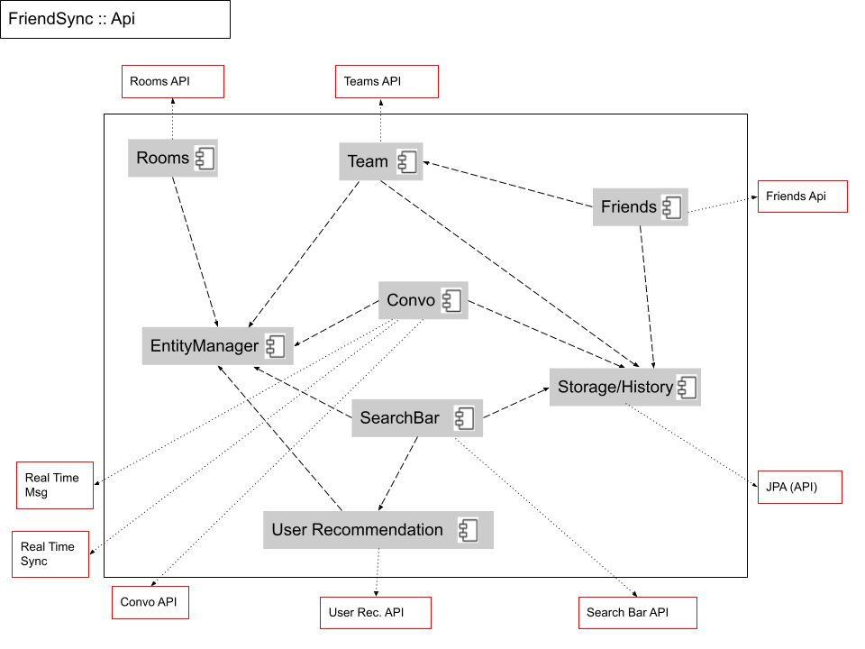

The interfaces that comes with the main building blocks:

| Interface      | Description                                                              |
|:-------------- |:------------------------------------------------------------------------ |
| Rooms API      | REST api for methods like creating rooms, joining rooms, leaving rooms   |
| Teams API      | REST api containing methods creating teams, joining teams, leaving teams |
| Convo API      | REST api for sending message and reading messages                        |
| Real Time Msg  | Interface for instant update of messages in convo                        |
| Friends API    | REST api for friend request, accepting request, updating profile,        |
| JPA (API)      | REST api for storing conversation histories                              |
| Search Bar API | REST api for searching friends, rooms, teams                             |
| User Rec. API  | REST api for recommending new potential friends                          |
| Real Time Sync | Interface for data sync across convo, rooms, teams and users data        |

The following diagram are higher level of the 6 entities that are part of the building blocks:

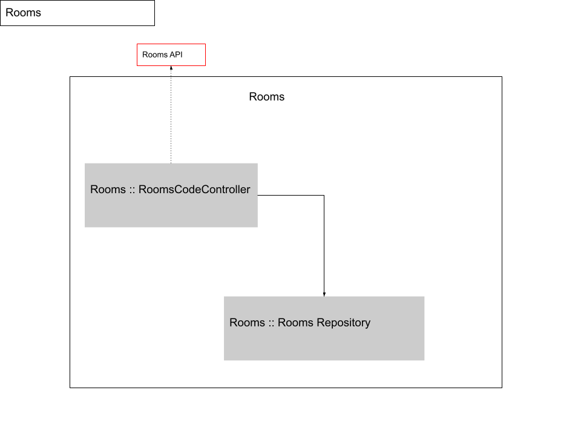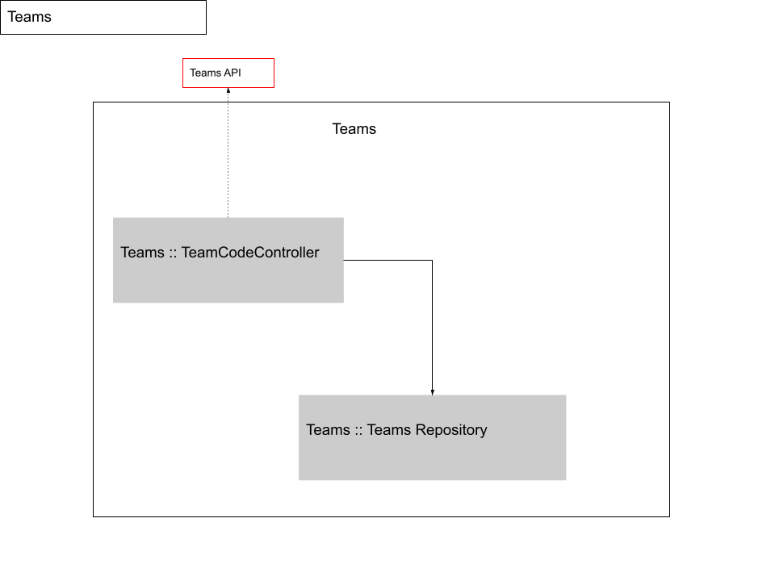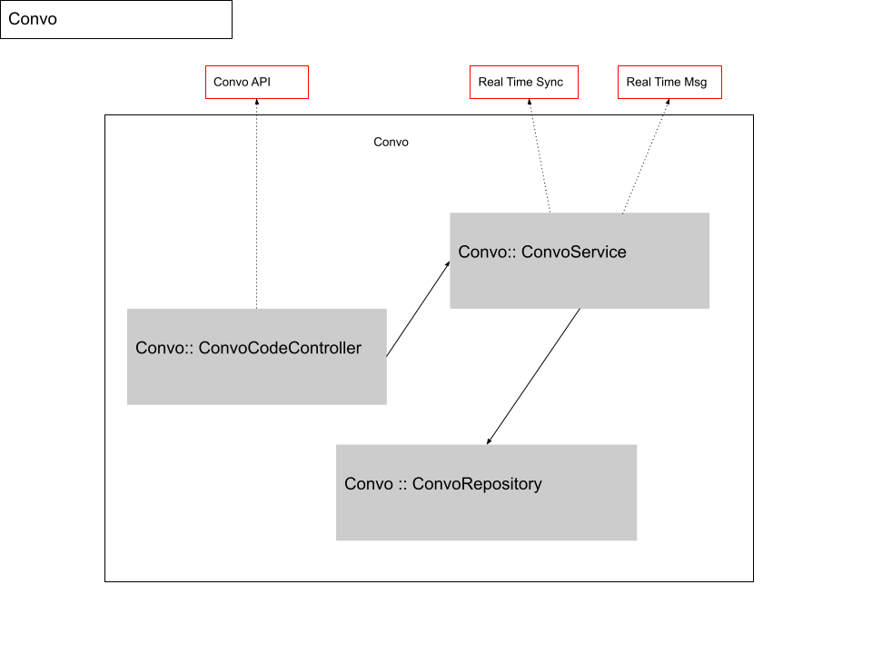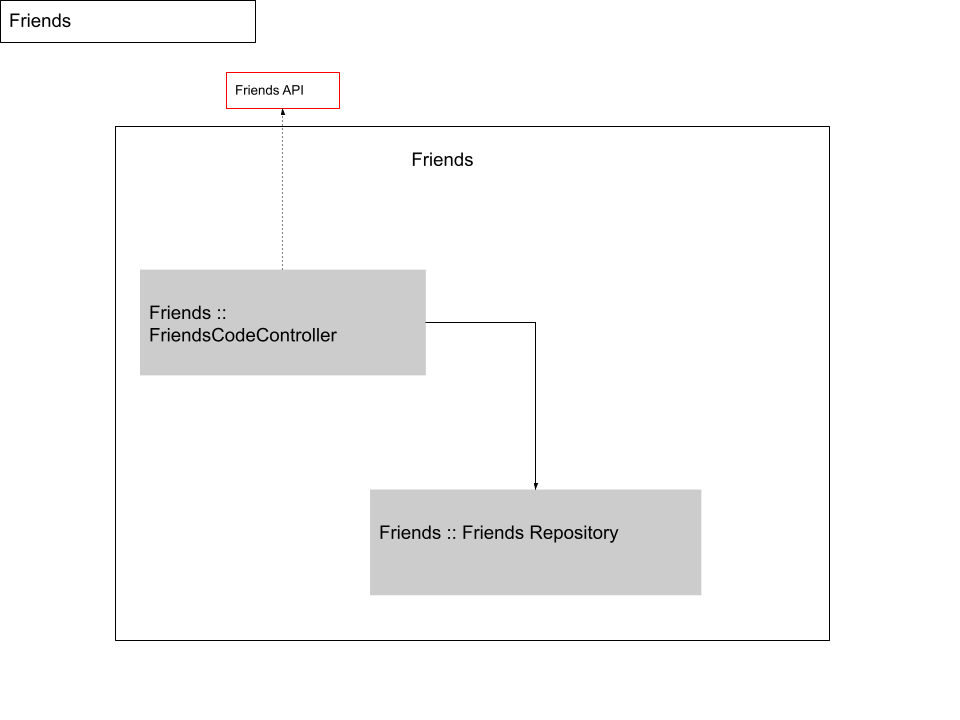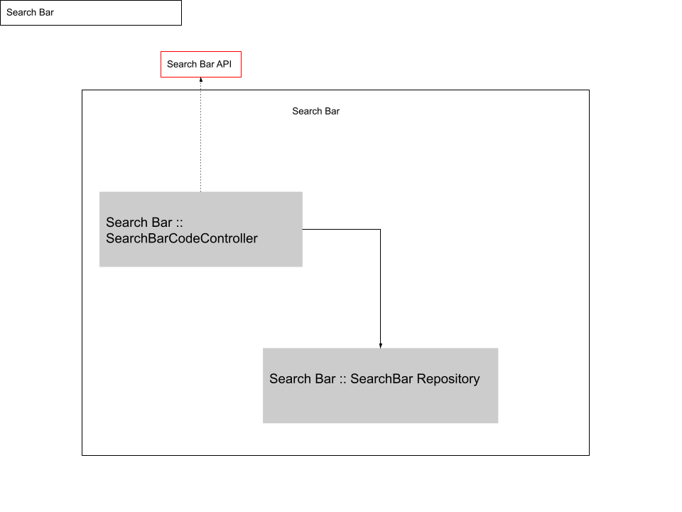

### Runtime View

Example of data flow or data creation using a scenario of room creation:

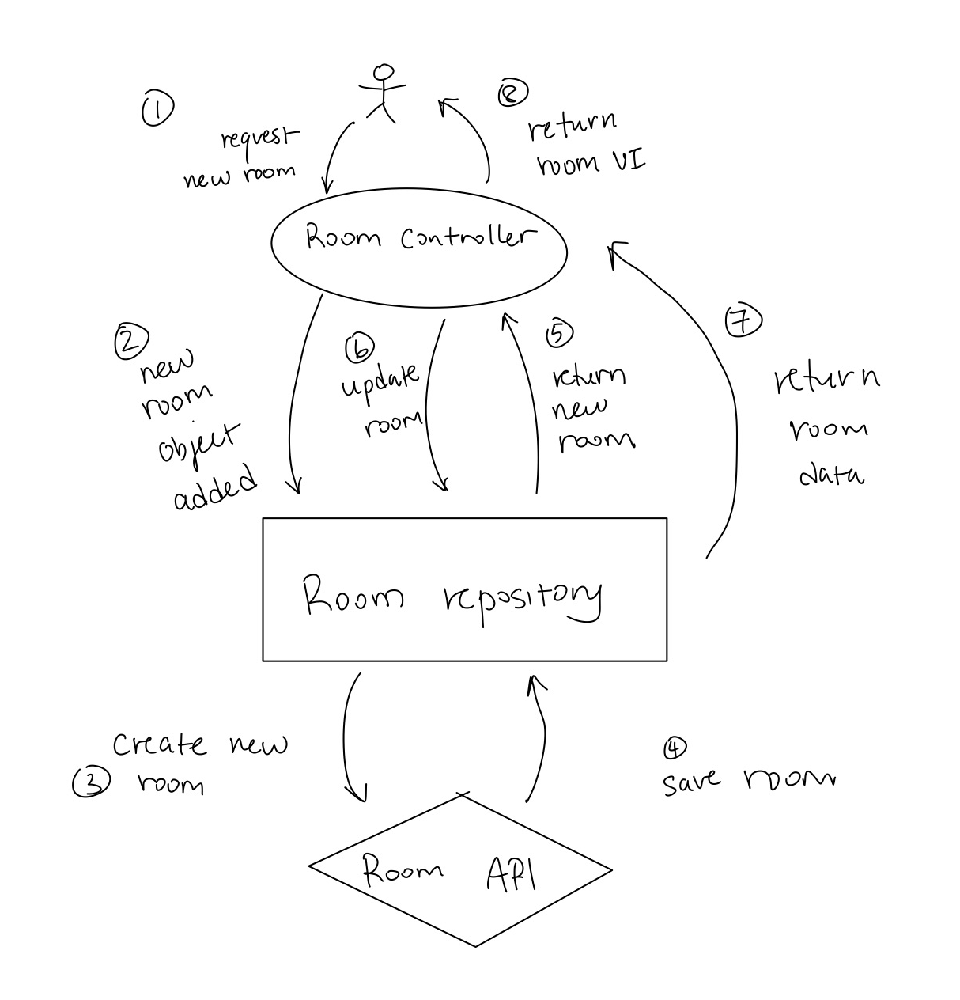

### Concepts

The following ER-Diagram shows the relationship and data flow of the data model:

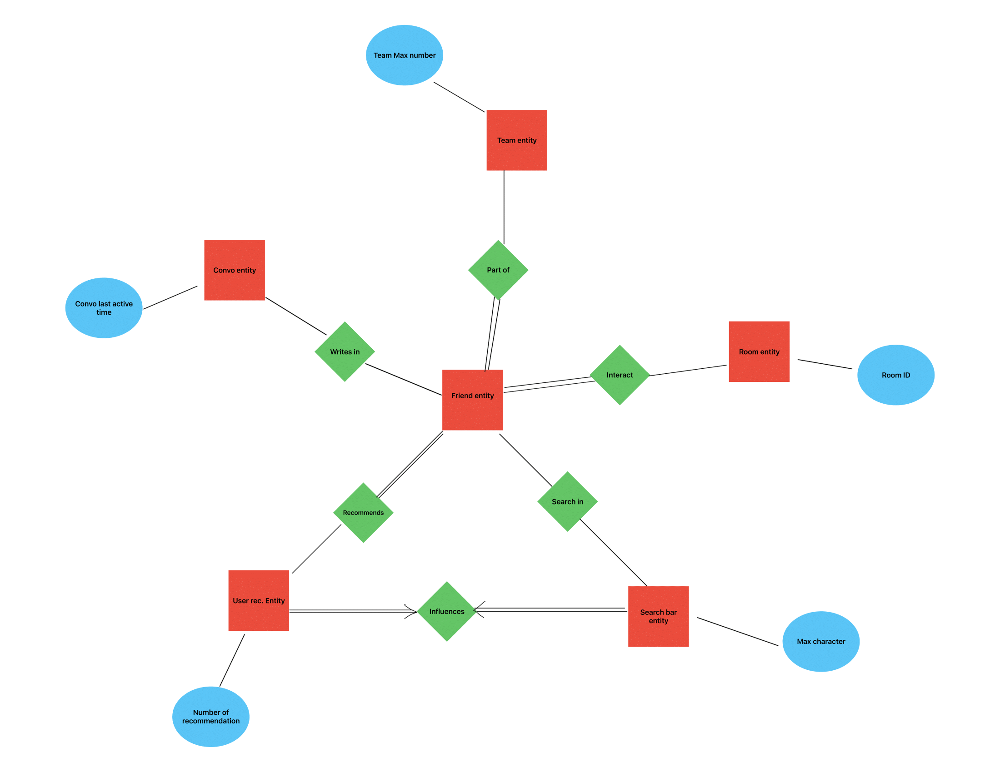

### Plausibility and Validity Checks

 Important validation checks:

- Any activity such as log in, sign in or profile updating must be checked for validity of information and respect of constraints.

- For friend request, prior history between the two user must be checked to see if they are valid users, if they already friend and if there is already a friend request in the process.

- For creation of room or team, system will check for existing room or team and check for no duplication.

- For user's action such as joining a room or team, validation checks will be done to check if the user isn't already in the room or the team and if the user's leaves the room or team, system will check if the action was successful by checking the removal of the user ID from the room or the team

- For conversation in rooms or teams, sync validation of data to check consistency of data across all devices and check for synchronization errors.

### Exception/Error Handling

 Any error or exceptions outputted by the system in regards to invalid compliance with the data model constraints will be in the HTTP
 errors format. The frontend code will handle the errors in due fashion. 

---

## Component design

### Client

The client is response for interact with user. The client forwards the user's operations to the server through APIs. And according to the content returned by the server, different web page content is presented.

Bellow are functions of the client.

- Register
  
  input: valid and unregistered email and password
  
  output: success or failure reasons

- Login
  
  input: valid and registered email and correct password
  
  output: success or failure reasons

- Logout

**All functions bellow should not be available before login**

- Update profile
  
  input: new user profile
  
  output: success or failure reasons

- Search users/rooms/teams
  
  output: a user/room/team list

- Create room
  
  input: room information
  
  output: success or failure reasons

- Create team
  
  input: team information
  
  output: success or failure reasons

- Join room
  
  input: room id
  
  output: success or failure reasons

- Join team
  
  input: team id and valid team license
  
  output: success or failure reasons

- Leave a room or team
  
  input: team id

- Get user recommendation
  
  output: a list of recommend users

- Send message to a conversation
  
  input: conversation type (user/team/room) and its id, message content

- Get message history of a conversation
  
  input: conversation type (user/team/room) and its id
  
  output: list of messages

### Server

The server is responsible for receiving client information and operating on the database. And third-party interfaces can be used to implement third-party login.

The server can be divided into tree layers.

- Control layer
  The control layer is responsible for accepting HTTP requests and invoking service-layer functions. Then return the response.

- Service layer
  
  The service layer is responsible for invoking the persistence layer interface and processing the business logic.

- Persistence layer
  
  The persistence layer depends on a standard JPA (Java Persistence API) and directly operate the MySQL database.

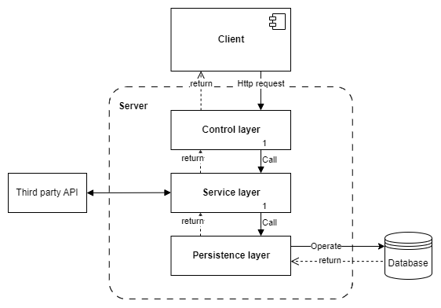

### Database

During development and production the MySQL database is retained and not in-memory based. The location of this file is configured through the `spring.datasource.url`.

### Third party login API

It is used for third-party login.

---

## High-Level Interface Design for Partner Matching System

> Below is a high-level design covering **communication, function inputs/outputs, exceptions, and security**.

## 1. Internal and External Component Communication

### Communication Flow

1. Frontend (Vue) makes REST API requests to the Spring Boot backend.
2. Backend handles business logic using Spring Boot and interacts with:
   - MySQL (Persistent Data)
3. Swagger + Knife4j provides API documentation.

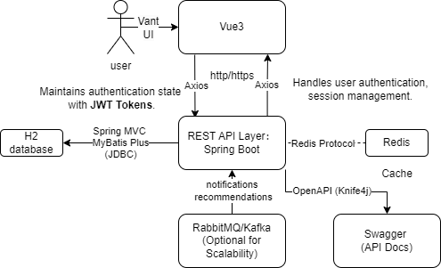

## 2. Expected Function Inputs and Outputs

Below are key API endpoints, expected inputs, and outputs.

The api root url is `localhost:8088/api`. It can be changed by the `src/main/resources/application.yml`.

---

## user API

path: `localhost:8088/api/user`

### Register

path: `localhost:8088/api/user/register`
method: POST
request body: 

``` java
public class UserRegisterRequest implements Serializable {
    private String userAccount;
    private String userPassword;
    private String checkPassword;
    private String planetCode;  // I don't know what it means. Ask stevenPang
}
```
return body:
``` java
public class BaseResponse<T> implements Serializable {
    private int code;
    private T data; // Generics increase reusability
    private String message;
    private String description;
}
```
  data:
  - -1 if failed
  - user id if success

### Login

path: `localhost:8088/api/user/login`
method: POST
request body: 
``` java
public class UserLoginRequest implements Serializable {
    private String userAccount;
    private String userPassword;
}
```
return body:
``` java
public class BaseResponse<T> implements Serializable {
    private int code;
    private T data; // Generics increase reusability
    private String message;
    private String description;
}
```
  data:
  - null if failed
  - User object if success
``` java
public class User implements Serializable {
    @TableId
    private Long id;
    private String username;
    private String userAccount;
    private String userPassword;
    private String avatarUrl;
    private Integer gender;
    private String phone;
    private String email;
    private Integer userStatus;
    private Date createTime;
    private Date updateTime;
    @TableLogic
    private Integer isDelete;
    private Integer userRole;
    private String planetCode;
    private String tags;
}
```
after login, session will have a new attribute: `"userLoginState": User object`

### Logout

path: `localhost:8088/api/user/register`
method: POST
request body: not needed
return body:
``` java
public class BaseResponse<T> implements Serializable {
    private int code;
    private T data; // Generics increase reusability
    private String message;
    private String description;
}
```
  data:
  - 1
Will remove the `"userLoginState"` attribute of the session.

### Get current user

path: `localhost:8088/api/user/current`
method: GET
request body: not needed
return body:
``` java
public class BaseResponse<T> implements Serializable {
    private int code;
    private T data; // Generics increase reusability
    private String message;
    private String description;
}
```
  data:
  - User object

### Search

path: `localhost:8088/api/user/search`
method: GET
request parameter: `username`
return body:
``` java
public class BaseResponse<T> implements Serializable {
    private int code;
    private T data; // Generics increase reusability
    private String message;
    private String description;
}
```
  data:
  - `List<User>`

### Delete

path: `localhost:8088/api/user/current`
method: POST
request body: `Long id`
return body:
``` java
public class BaseResponse<T> implements Serializable {
    private int code;
    private T data; // Generics increase reusability
    private String message;
    private String description;
}
```
  data:
  - true if success
  - false if failed
**The current user needs to be Admin**

---

## Conversation API

path: `localhost:8088/api/conversation`

### Search

path: `localhost:8088/api/conversation/search`
method: GET
request parameter: `String keyword`
return body:
HttpStatus.BAD_REQUEST 400:
  - `String "login first"` if not login
  - `String "need GET param: keyword"` if keyword is empty
HttpStatus.OK 200:
  - `List<Conversation>` if success
``` java
public class Conversation implements Serializable {
    public enum ConversationType { CHAT, TEAM, ROOM }
    private Long id;
    private ConversationType type;
    private Long ownerId;
    private String name;
    private String information;
    private String license;
}
```

### Create team or room

path: `localhost:8088/api/conversation/create-team-room`
method: POST
request body:
``` java
public class CreateTeamRoomRequest implements Serializable {
    private Long ownerId;
    private String name;
    private String information;
    private Conversation.ConversationType type;
}
```
return body:
HttpStatus.BAD_REQUEST 400:
  - `String "login first"` if not login
  - `String "wrong conversation type"` if keyword is empty
  - `String "failed"` if failed
HttpStatus.OK 200:
  - `Conversation` object if success
**License will be empty after create. If you want to join a team by license, need to generate one first.**

### Create Chat

path: `localhost:8088/api/conversation/create-chat`
method: POST
request body:
``` java
public class CreateChatRequest implements Serializable {
    private Long ownerId;
    private Long othersId;
}
```
return body:
HttpStatus.BAD_REQUEST 400:
  - `String "login first"` if not login
  - `String "cannot chat with self"` if `othersId` is same as `ownerId`
  - `String "failed"` if failed
HttpStatus.OK 200:
  - `Conversation` object if success
**OwnerId should be same as current user's id.**

### Generate License

path: `localhost:8088/api/conversation/generate`
method: GET
request parameters:
  - `id` the id of the team conversation
return body:
HttpStatus.BAD_REQUEST 400:
  - `String "login first"` if not login
  - `String "failed"` if failed
HttpStatus.OK 200:
  - `String` the license if success
**The current user should be the owner of the team or the Admin.**

### Get the conversations own

path: `localhost:8088/api/conversation/getown`
method: GET
request parameters: not needed
return body:
HttpStatus.BAD_REQUEST 400:
  - `String "login first"` if not login
HttpStatus.OK 200:
  - `List<Conversation` the list of the conversation the current user own

### Delete conversation

path: `localhost:8088/api/conversation/delete`
method: GET
request parameters:
  - `id` the id of the conversation
return body:
HttpStatus.BAD_REQUEST 400:
  - `String "login first"` if not login
  - `String "failed"` if failed
HttpStatus.OK 200:
  - `String "success"` if success
**The current user should be the owner of the team or the Admin.**

### Get all conversations

path: `localhost:8088/api/conversation/all`
method: GET
request parameters: not needed
return body:
HttpStatus.BAD_REQUEST 400:
  - `String "login first"` if not login
  - `String "not admin"` if the user is not the admin
HttpStatus.OK 200:
  - `List<Conversation>` if success
**The current user should be the Admin.**

---

## User conversation API

path: `localhost:8088/api/user-conversation`


### Get joined conversation
path: `localhost:8088/api/user-conversation/joined`
method: GET
request parameters: not needed
return body:
HttpStatus.BAD_REQUEST 400:
  - `String "login first"` if not login
HttpStatus.OK 200:
  - `List<Conversation>` if success

### Join room
path: `localhost:8088/api/user-conversation/join-room`
method: GET
request parameters: `id` the room id
return body:
HttpStatus.BAD_REQUEST 400:
  - `String "login first"` if not login
HttpStatus.OK 200:
  - `Conversation` the room conversation object if success

### Join team
path: `localhost:8088/api/user-conversation/join-team`
method: GET
request parameters:
  - `id` the team id
  - `license` the license
return body:
HttpStatus.BAD_REQUEST 400:
  - `String "login first"` if not login
  - `String "wrong license"` if the license is wrong
HttpStatus.OK 200:
  - `Conversation` the room conversation object if success

### Leave
path: `localhost:8088/api/user-conversation/leave`
method: GET
request parameters:
  - `id` the conversation id
  - `new_owner` the new owner id (not required if the user is not the owner)
return body:
HttpStatus.BAD_REQUEST 400:
  - `String "login first"` if not login
  - `String "user or new owner not in the conversation"` if not in the conversation
HttpStatus.OK 200:
  - `String "success"` the room conversation object if success

---

## Chat message API

path: `localhost:8088/api/message`

### Get message
path: `localhost:8088/api/message/get`
method: POST
request body:
``` java
public class GetMessageRequest implements Serializable {
    Long conversationId;
    Integer offset;
    Integer num;
}
```
return body:
HttpStatus.BAD_REQUEST 400:
  - `String "login first"` if not login
HttpStatus.OK 200:
  - `List<ChatMessage>` if success
``` java
public class ChatMessage implements Serializable {
    private Long id;
    private Long conversationId;
    private Long senderId;
    private Timestamp sendTime;
    private String msgContent;
}
```

### Send message
path: `localhost:8088/api/message/send`
method: POST
request body:
``` java
public class SendMessageRequest implements Serializable {
    Long conversationId;
    Long userId;
    String content;
}
```
return body:
HttpStatus.BAD_REQUEST 400:
  - `String "login first"` if not login
HttpStatus.OK 200:
  - `String "success"` if success

## 3. Communication Protocols

The system communicates via REST API using HTTP/HTTPS.

| **Component**                    | **Communication Protocol** | **Description**                       |
| -------------------------------- | -------------------------- | ------------------------------------- |
| **Frontend ↔ Backend**           | REST API (HTTP/HTTPS)      | Vue sends API requests to Spring Boot |
| **Backend ↔ Database (MySQL)**   | JDBC (MyBatis)             | SQL queries for persistent storage    |
| **Backend ↔ Redis**              | Redis Protocol             | Caching user search results           |
| **Backend ↔ Swagger (API Docs)** | OpenAPI (Knife4j)          | API documentation                     |

API secured via HTTPS for encrypted communication.

## 4. Expected Exceptions and How They Are Handled

| **Exception**           | **Cause**                     | **HTTP Status Code** | **Error Message**                          |
| ----------------------- | ----------------------------- | -------------------- | ------------------------------------------ |
| `USER_NOT_FOUND`        | User ID does not exist        | `40001 NULL_ERROR`   | `{ "error": "User not found" }`            |
| `INVALID_TAG_FORMAT`    | Malformed tags                | `40000 PARAMS_ERROR` | `{ "error": "Invalid tag format" }`        |
| `TEAM_FULL`             | Team reached max members      | `40301 FORBIDDEN`    | `{ "error": "Team is full" }`              |
| `UNAUTHORIZED_ACCESS`   | No JWT token or invalid token | `40100 NOT_LOGIN`    | `{ "error": "Unauthorized" }`              |
| `NO_PERMISSION`         | User has no permission        | `40101 NO_AUTH`      | `{ "error": "User has no permission" }`    |
| `DUPLICATE_TEAM_JOIN`   | User already in team          | `40000 PARAMS_ERROR` | `{ "error": "User already in the team" }`  |
| `INTERNAL_SERVER_ERROR` | Unknown server error          | `50000 SYSTEM_ERROR` | `{ "error": "Unexpected error occurred" }` |

## 5. Security Measures

Security is enforced at multiple levels.

## Authentication

- JWT (JSON Web Token) for user authentication.

- Token passed in `Authorization` header.
  
  ### Authorization

- Role-Based Access Control (RBAC):
  
  - Only team creators can invite others.
  
  - Only team members can chat within a team.
  
  ### Data Protection

- User passwords hashed using BCrypt.

- Redis Cache Expiry to prevent stale data.
  
  ### Preventing API Abuse

- Rate limiting (limit search requests per minute).

- IP blacklisting for repeated failed logins.

- Example Rate Limiting (Spring Boot):
  
  ### Secure Data Transmission

- All API requests use HTTPS.

- CORS policies prevent unauthorized cross-origin requests.

---

## User Interface Design

**FriendSync** is a mobile HTML5 website designed to help users find like-minded individuals for collaboration based on shared interests and learning goals. This part outlines the **user interface (UI) design**, **site map**, **accessibility design** and **storyboard** for the FriendSync platform.

### Site Map

The platform's organization and navigation pathways are outlined in the site map. Below is the hierarchical arrangement showing how different sections connect and how users move between interfaces throughout the system.

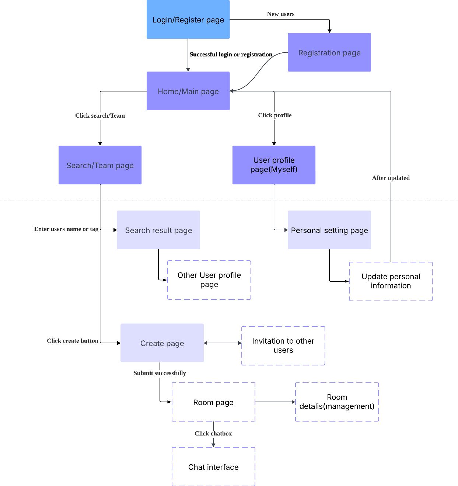

#### Detailed Navigation Flow

| Current Interface     | User Action                       | Next Interface                  |
| --------------------- | --------------------------------- | ------------------------------- |
| Login Page            | Enter email/password → login      | Home page                       |
| Login Page            | New users → Registration          | Registration page               |
| Search Page           | Enter users name or tags → search | Search page (results)           |
| Search page (results) | Click on users                    | User profile page (other users) |
| Search Page/Home page | Click create button               | Create room page                |
| Create room page      | Fill info(invitation) → submit    | Room page                       |
| Room page             | Click chat room                   | Chat interface                  |
| Chat interface        | Send message                      | Chat interface                  |
| User profile page     | Edit personal info → submit       | Home page/current page          |

### Accessibility Design

Inclusive design ensures that everyone can access, understand and enjoy the web. To ensure **FriendSync** is accessible to all users, we implement the following accessibility features:

1. **Color Contrast**: Meeting WCAG standards
   
   - Normal text: contrast ratio 4.5:1
   - Large text: contrast ratio 3:1

2. **Touch Targets**: Minimum size 9x9mm for all interactive elements

3. **Error Handling**:
   
   - Invalid inputs marked with aria-invalid
   - Focus moved to error location
   - Alert role implementation

4. **Consistent Layouts**: Predictable element placement to reduce cognitive load

5. **Keyboard Navigation**: Full Tab navigation support

6. **Responsive Web Design**: Optimal experience across different screens and devices

### Storyboard

The storyboard demonstrates key user journeys through the FriendSync platform:

1. Account Creation

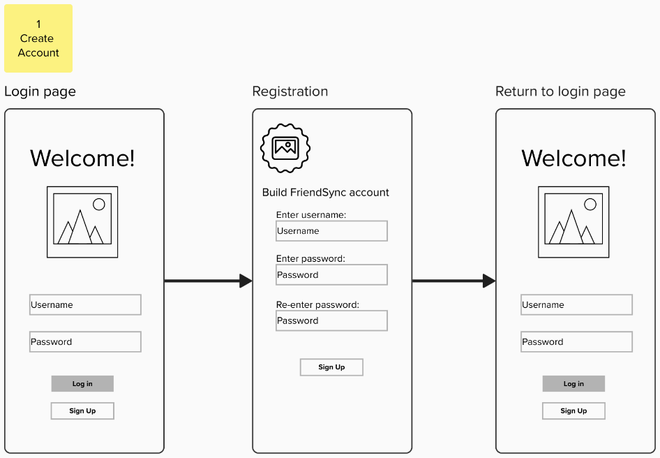

2. Searching

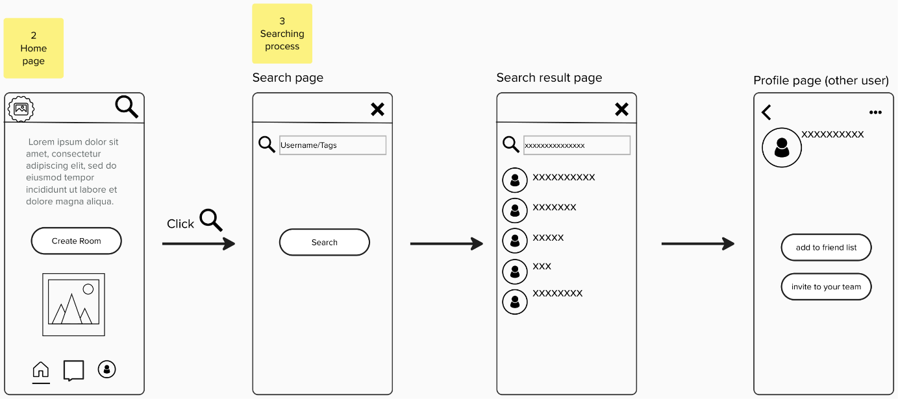

3. update personal profile

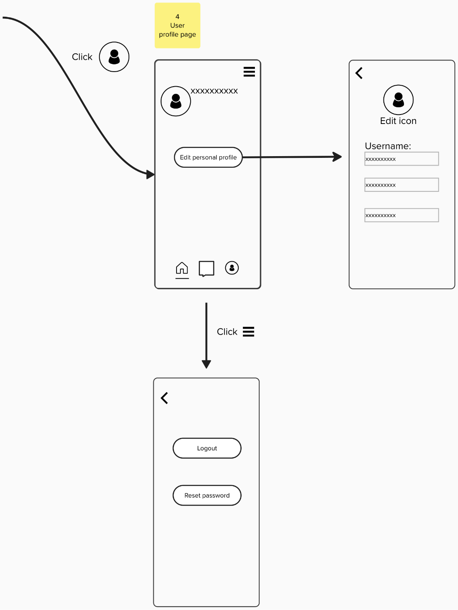

4. create room

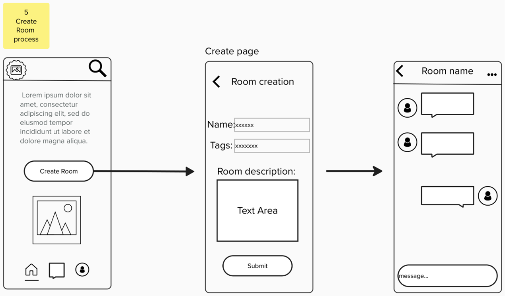

### Technical Specifications

- **Framework**: HTML5
- **Responsiveness**: Mobile-first design
- **Browser Support**: Latest 2 versions of major browsers

FriendSync's user interface design emphasizes:

- **Comprehensive Accessibility**: Implementation of WCAG standards and inclusive design principles
- **Intuitive Navigation**: Clear pathways and consistent interaction patterns
- **User-Centric Design**: Features optimized for diverse user needs and preferences
- **Collaborative Focus**: Interface elements that facilitate meaningful connections
- **Responsive Implementation**: Seamless experience across all devices and platforms

Through careful consideration of accessibility, usability, and technical requirements, FriendSync delivers an inclusive platform that enables users to forge valuable connections based on shared interests and learning objectives.

---

## Assumption

The following assumptions are made during the development of the FriendSync application:

1. User Availability and Engagement
   It is assumed that users will be actively engaged with the platform and maintain their profiles and tags.
2. Internet Access
   The system assumes that users will have access to a stable internet connection, as the platform is web-based and requires online connectivity for many of its features.
3. Tagging System
   Tags used to categorize users, and their learning interests will be consistently applied by users to ensure accurate search and recommendation functionalities.
4. External Integrations
   The system may depend on future integrations with other educational or social platforms (such as Learning Management Systems) that could affect the functionality and user experience.
5. Third-Party Authentication Services
   The system will rely on OAuth or similar third-party authentication services for user login. Changes to the OAuth API or services could affect the functionality of the authentication system.
